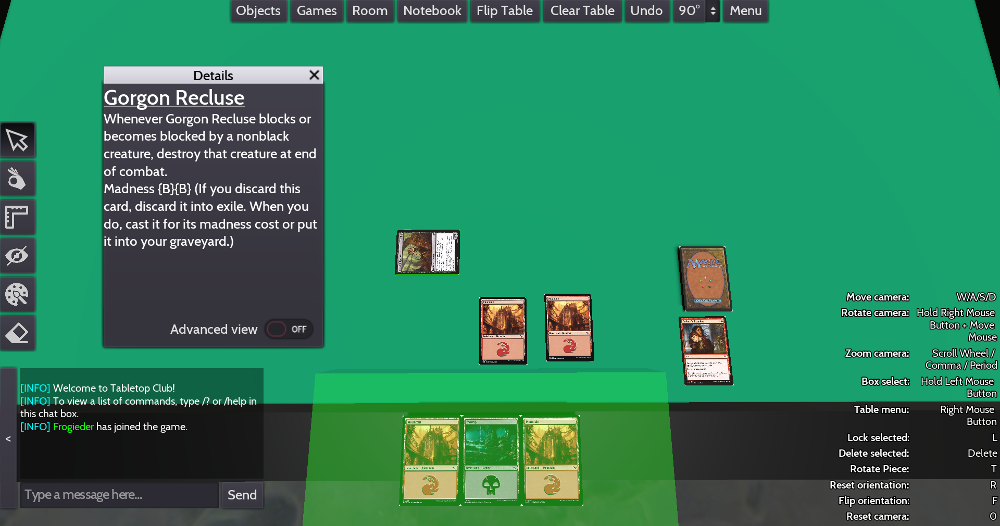

# MTG decks for Tabletop Club
This tool is made for the [Tabletop Club](https://github.com/drwhut/tabletop-club).
It allows to automatically create asset packs for individual Magic The Gathering decks.

Double-sided cards are currently not supported



# Prerequesites
install requests and sqlite3 as python 3 libraries (either using pip or your system package manager).
tested on python 3.10, but it should be compatible with older versions as well.

# Initialize the database
Run:
```shell
python3 build_card_database
```
This downloads `oracle-cards.json` from scryfall and creates a sqlite database to store the required data.
You only need to do this once

# Building and importing a deck
Run:
```shell
python3 download_cards
```

The command asks for two inputs: The deck name and the decklist. 
The decklist must be in the Arena format and sideboard (if it exists) has to be separated by a separate line saying `Sideboard` or `[Sideboard]`.
Other lines that start with `[` are ignored.

Repeat this for every deck you need.

# Import the asset pack
The asset pack will be saved into the `generated_packs/[name]`
Copy the folder that has the name of your deck into `Documents/TabletopClub/assets`.
After that, restart Tabletop Club and it will load automatically.
The loaded assets include all your cards, plus two stacks: one of them is your mainboard and the other one is the sideboard.

# Support
You can find me on the Discord server dedicated to Tabletop Club - there should be a thread dedicated to this project. My Discord username is Frogieder.